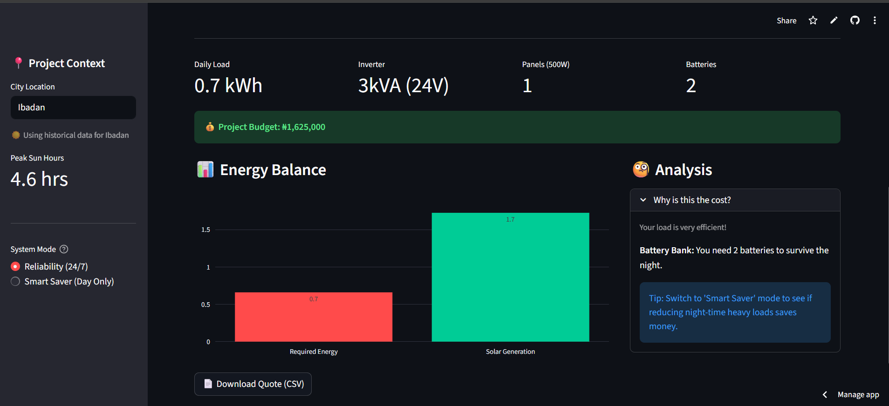

# ⚡ NaijaSolarOps: Intelligent Solar Sizing Engine

[](https://naija-solar-calculator.streamlit.app/)
[](https://www.python.org/)
[](https://opensource.org/licenses/MIT)

> **Live Demo:** [https://naija-solar-calculator.streamlit.app/](https://naija-solar-calculator.streamlit.app/)

## Executive Summary
**NaijaSolarOps** is a data-driven feasibility tool designed to address the energy reliability crisis in Nigeria. With the recent implementation of "Band A" electricity tariffs and rising fuel costs, solar energy is no longer a luxury but a necessity.

However, solar adoption faces a critical barrier: **Information Asymmetry.** Users often receive inflated quotes or undersized systems. This application uses **geospatial data** and **electrical engineering logic** to provide accurate, location-specific solar sizing and financial estimates for Nigerian homes and businesses.

---

## Interface Preview


---

## Key Features

### 1. Geospatial Intelligence
Unlike generic calculators, this engine adjusts solar yield based on the user's specific city in Nigeria.
* **Logic:** Leveraging `GeoPy`, the app detects the user's latitude.
* **Impact:** A 5kW system in **Kano** (5.8 Peak Sun Hours) generates ~20% more power than in **Port Harcourt** (3.8 Peak Sun Hours). The app adjusts the panel count accordingly.

### 2. Engineering-Grade Sizing Logic
The calculator distinguishes between two critical electrical metrics:
* **Energy Demand (kWh):** Determines battery bank size (Autonomy).
* **Peak Power (kW) & Surge:** Determines Inverter capacity. It accounts for inductive loads (e.g., Pumping machines, Freezers) that require 3x startup current, preventing system tripping.

### 3. Market-Reflective Financials
* Includes a database of **November 2025 Market Prices** (Lagos/Alaba International Market estimates).
* Dynamically calculates the Bill of Materials (BOM) including cabling and installation overheads.

### 4. "Smart Saver" vs. "Reliability" Modes
* **Reliability Mode:** Sizes batteries to run *everything* 24/7.
* **Smart Saver Mode:** Algorithmic optimization that assumes heavy loads (ACs, Washing Machines) run only during sun hours, drastically reducing battery CAPEX by ~40%.

---

## Technical Architecture

### Tech Stack
* **Frontend:** Streamlit (Python)
* **Data Processing:** Pandas
* **Visualization:** Plotly Interactive Charts
* **Geocoding:** GeoPy / Nominatim API
* **Deployment:** Streamlit Cloud

### The Math Behind the Magic
The application uses the following core formulas for sizing:

**1. Solar Array Sizing:**
$$P_{array} = \frac{E_{daily}}{H_{sun} \times \eta_{sys}}$$
*Where $$E_{daily}$$ is daily energy need, $H_{sun}$ is Peak Sun Hours (Location based), and $\eta_{sys}$ is system efficiency (approx 0.7).*

**2. Battery Bank Sizing:**
$$C_{batt} = \frac{E_{night}}{V_{sys} \times DoD}$$
*Where $E_{night}$ is the energy consumed during darkness, $V_{sys}$ is system voltage (24V/48V), and $DoD$ is Depth of Discharge (50% for Lead Acid).*

---

## 📂 Project Structure

```bash
naija-solar-calculator/
├── app.py                # Main application logic
├── requirements.txt      # Python dependencies
├── packages.txt          # System-level dependencies (if needed)
├── assets/               # Images and static files
│   └── demo_screenshot.png
├── .gitignore            # Git exclusion rules
└── README.md             # Documentation# naija-solar-calc
